# Kubernetes Cluster Setup – Technical Guide and Log

## 1. Boilerplate Setup (All Nodes)
Prepare all nodes with consistent OS settings, disable swap, apply sysctl parameters, and install containerd.

**Reflection:** Swap must be disabled for accurate memory accounting. `ip_forward` and `br_netfilter` enable Pod networking across nodes.

### Commands and Purpose
| Command | Purpose | Why Necessary | Verification |
|----------|----------|----------------|---------------|
| `sudo apt update && sudo apt -y upgrade` | Update packages | Ensure OS is patched | `apt list --upgradable` |
| `sudo swapoff -a` | Disable swap temporarily | Scheduler needs no swap | `free -h` shows 0 swap |
| `sudo sed -i '/ swap / s/^/#/' /etc/fstab` | Disable swap permanently by commenting the swap line in /etc/fstab file | Prevent swap after reboot | `cat /etc/fstab` |
| `echo -e "overlay\nbr_netfilter" \| sudo tee /etc/modules-load.d/containerd.conf`| Load `overlay` & `br_netfilter` | Needed for networking | `lsmod | grep br_netfilter` |
| `sudo modprobe overlay && sudo modprobe br_netfilter` | Load kernel modules | Needed for container networking and filesystems | `lsmod | grep br_netfilter` |
| `echo -e "net.bridge.bridge-nf-call-iptables = 1\nnet.bridge.bridge-nf-call-ip6tables = 1\nnet.ipv4.ip_forward = 1" \| sudo tee /etc/sysctl.d/99-kubernetes-cri.conf` | Enable iptables, IPv6, and forwarding | Needed for services and routing | `sysctl net.ipv4.ip_forward` = 1 |
| `sudo sysctl --system ` | Apply sysctl settings | Enable ip_forward and bridge netfilter | `sysctl net.ipv4.ip_forward` = 1 |
| `sudo apt install -y containerd` | Install container runtime | Required for Pods | `systemctl status containerd` |
| `ssudo mkdir -p /etc/containerd && containerd config default \| sudo tee /etc/containerd/config.toml >/dev/null  ` | Create default config for containerd and put it in config.toml | Configuration for containerd to run | cat config.toml should have configurations sudo |
| Edit `/etc/containerd/config.toml` and set `SystemdCgroup=true` | Align cgroup drivers | Kubelet & containerd must use same cgroup driver | `grep SystemdCgroup /etc/containerd/config.toml` |
| `sudo systemctl restart/enable containerd` | Restart containderd and enable it so it runs automatically | Need containerd to run automatically for kubernetes to function properly | Systemctl status containerd shoud show enabled and active |

**Tip:** Use `grep –nF 'pattern' filename` to find line numbers.

---

## 2. Install Kubernetes Tools (All Nodes)
Install `kubelet`, `kubeadm`, and `kubectl`. These form the core of Kubernetes.

**Reflection:** Installing GPG keys and repositories reinforces package security principles.

| Command | Purpose | Why Necessary | Verification |
|----------|----------|----------------|---------------|
| `sudo apt install -y apt-transport-https ca-certificates curl gpg` | Install prereqs | Enable HTTPS repos and key management | `curl --version`, `gpg --version` |
| `sudo mkdir -p /etc/apt/keyrings`<br>`curl -fsSL https://pkgs.k8s.io/core:/stable:/v1.30/deb/Release.key \| sudo gpg --dearmor -o /etc/apt/keyrings/kubernetes-apt-keyring.gpg` | Add Kubernetes repo key | Verify and trust Kubernetes packages | `ls /etc/apt/keyrings/` |
| `echo "deb [signed-by=/etc/apt/keyrings/kubernetes-apt-keyring.gpg] https://pkgs.k8s.io/core:/stable:/v1.30/deb/ /" \| sudo tee /etc/apt/sources.list.d/kubernetes.list` | Add Kubernetes apt repo | Source for kubeadm, kubelet, kubectl | `cat /etc/apt/sources.list.d/kubernetes.list` |
| `sudo apt update && sudo apt install -y kubelet kubeadm kubectl` | Install Kubernetes tools | Needed to bootstrap and manage cluster | `kubeadm version`, `kubectl version --client` |
| `sudo apt-mark hold kubelet kubeadm kubectl` | Prevent auto-updates | Avoid version mismatches across nodes | `apt-mark showhold` |


---

## 3. Control Plane Initialization
Initialize control-plane and configure networking.

**Reflection:** Similar to promoting a domain controller — defines the cluster brain.

| Command | Purpose | Why Necessary | Verification |
|----------|----------|----------------|---------------|
| `sudo kubeadm init --apiserver-advertise-address=192.168.101.89 --pod-network-cidr=10.244.0.0/16` | Initialize the control-plane node and set up cluster core components | Bootstraps the control plane by creating the API server, etcd, controller manager, scheduler, and certificates. It also installs core add-ons like DNS and kube-proxy. Without initialization, worker nodes cannot join and the cluster cannot function. | `kubectl get nodes` after setup should show the control-plane node in `NotReady` state until networking is applied. |
| `kubeadm join 192.168.101.89:6443 --token <token> --discovery-token-ca-cert-hash <hash>` | Join worker nodes to the cluster | Connects a node to the control-plane using a secure token and CA hash, allowing it to register as a worker and start running workloads. | `kubectl get nodes` should show the new node after a few minutes. Use `kubeadm token list` to check tokens or `kubeadm token create --print-join-command` to generate a new one if expired. |
| `mkdir -p $HOME/.kube`<br>`sudo cp -i /etc/kubernetes/admin.conf $HOME/.kube/config`<br>`sudo chown $(id -u):$(id -g) $HOME/.kube/config` | Configure `kubectl` for the current user | Copies the admin kubeconfig to the user’s home directory and adjusts ownership so `kubectl` commands can be executed without `sudo`. Without this, you’d need elevated privileges for every command. | `kubectl get nodes` should return the cluster’s nodes successfully without `sudo`. |
| `kubectl apply -f https://raw.githubusercontent.com/flannel-io/flannel/refs/heads/master/Documentation/kube-flannel.yml` | Deploy the Flannel CNI plugin (Pod network) | Installs a Container Network Interface (CNI) to enable pod-to-pod communication across nodes. Without it, pods cannot communicate between nodes, keeping nodes in `NotReady` state. | `kubectl -n kube-system get pods -o wide` should show `flannel` pods running, and `kubectl get nodes` should show nodes as `Ready`. |

###At this point, all the nodes should be in the cluster connected. 

Verify node readiness:
```bash
kubectl get nodes
```

---

## 4. Cluster Health and Sanity Checks
Test inter-pod connectivity and DNS resolution.


| Command | Purpose | Why Necessary | Verification |
|----------|----------|----------------|---------------|
| `Pod_a=<pod_name> in node1`<br>`Pod_b_ip=<pod_ip> of pod in node2`<br>`kubectl exec -it $Pod_a -- ping -c3 $Pod_b_ip` | Test Pod-to-Pod cross-node connectivity | Verifies that the cluster network (CNI) correctly routes traffic between pods on different nodes. Confirms that the network overlay (e.g., Flannel, Calico) is functioning. | Ping should succeed with no packet loss, proving cross-node communication works. |
| `POD=$(kubectl get pod -l app=netshoot -o jsonpath='{.items[0].metadata.name}')`<br>`kubectl exec -it $POD -- nslookup kubernetes.default` | Verify DNS resolution inside the cluster | Confirms that CoreDNS is operational and that pods can resolve internal service names to ClusterIPs. Without functional DNS, services cannot communicate by name. | Should resolve `kubernetes.default` to a ClusterIP, confirming DNS health. |
| `kubectl create deploy echo --image=hashicorp/http-echo -- /http-echo -text="ok"`<br>`kubectl expose deploy echo --port=5678`<br>`kubectl exec -it $POD -- wget -qO- http://echo:5678` | Validate Service-to-Pod routing | Ensures that Kubernetes Services correctly route traffic to backend pods using cluster networking and kube-proxy. Validates internal load balancing. | Output should return `ok`, confirming service routing and pod reachability. |


All tests should succeed (ping, DNS, service routing).

---

## 5. Infrastructure Installation
Install essential tools.

| Command | Purpose | Why Necessary | Verification |
|----------|----------|----------------|---------------|
| `Pod_a=<pod_name> in node1`<br>`Pod_b_ip=<pod_ip> of pod in node2`<br>`kubectl exec -it $Pod_a -- ping -c3 $Pod_b_ip` | Test Pod-to-Pod cross-node connectivity | Verifies that the cluster network (CNI) correctly routes traffic between pods on different nodes. Confirms that the network overlay (e.g., Flannel, Calico) is functioning. | Ping should succeed with no packet loss, proving cross-node communication works. |
| `POD=$(kubectl get pod -l app=netshoot -o jsonpath='{.items[0].metadata.name}')`<br>`kubectl exec -it $POD -- nslookup kubernetes.default` | Verify DNS resolution inside the cluster | Confirms that CoreDNS is operational and that pods can resolve internal service names to ClusterIPs. Without functional DNS, services cannot communicate by name. | Should resolve `kubernetes.default` to a ClusterIP, confirming DNS health. |
| `kubectl create deploy echo --image=hashicorp/http-echo -- /http-echo -text="ok"`<br>`kubectl expose deploy echo --port=5678`<br>`kubectl exec -it $POD -- wget -qO- http://echo:5678` | Validate Service-to-Pod routing | Ensures that Kubernetes Services correctly route traffic to backend pods using cluster networking and kube-proxy. Validates internal load balancing. | Output should return `ok`, confirming service routing and pod reachability. |


### Reset Cluster (if needed or you mess up something, for example the external ip of the nodes changed which I tried fixing and messed up whole lot of things)
```bash
sudo kubeadm reset -f
sudo systemctl stop kubelet containerd
sudo rm -rf /etc/cni/net.d /var/lib/cni/ /var/lib/kubelet /etc/kubernetes /var/lib/etcd
sudo ip link delete cni0
sudo ip link delete flannel.1
```

---

## 6. Containerizing the Apps

### 6.1 Writing Dockerfiles

A **Dockerfile** is a blueprint for creating a container image.  
For my portfolio app, I used two separate **Node:20-alpine** images — one for **build** and one for **runtime**.

1. In the **build stage**, I copied the `package*.json` files into `/app` and ran `npm ci` to perform a clean installation of dependencies.  
   Using `npm ci` instead of `npm install` ensures reproducible builds and faster installs when `package-lock.json` is present.

2. I then used `COPY . .` to copy the full source code (excluding files in `.dockerignore`) and ran `npm run build`, which created the production build of the app.

3. In the **runtime stage**, I used another **Node:20-alpine** image for a lightweight environment.  
   I copied only the compiled output — static, public, and standalone files — into the new image.  
   This minimizes image size and attack surface.

4. Permissions were set using:
   ```bash
   RUN mkdir -p .next/cache && chown -R node:node .next
   ```
5. I used the **USER node** directive for security (to avoid running as root) and exposed port 3000.
6. Finally, the container runs the app using:
   ```bash
   CMD ["node", "server.js"]
   ```

**Dockerfile for our NextPortfolio App**
```bash
# Build stage
FROM node:20-alpine AS build
WORKDIR /app

# Install dependencies
COPY package*.json ./
RUN npm ci

# Copy all files and build
COPY . .
RUN npm run build

# Production stage
FROM node:20-alpine
WORKDIR /app
ENV NODE_ENV=production
ENV PORT=3000

# Copy only necessary files from build stage
COPY --from=build /app/.next/standalone ./
COPY --from=build /app/.next/static ./.next/static
COPY --from=build /app/public ./public

# Give permission to node user
RUN mkdir -p .next/cache && chown -R node:node .next

# Run as non-root user
USER node
EXPOSE 3000

# Start application
CMD ["node", "server.js"]

```
   
### 6.2 Argo CD Setup
Install via [official guide](https://argo-cd.readthedocs.io/en/stable/getting_started/). Convert `argocd-server` service to LoadBalancer (`kubectl –n argocd edit svc argocd-server`) and allocate some MetalLB IP range for example, `192.168.101.220–230`.

**MetalLB Configuration (metallb-pool.yaml)**
```yaml
# metallb-pool.yaml

apiVersion: metallb.io/v1beta1
kind: IPAddressPool
metadata:
  name: lb-pool
  namespace: metallb-system
spec:
  addresses:
    - 192.168.101.200-192.168.101.210  # make sure these are UNUSED

---
apiVersion: metallb.io/v1beta1
kind: L2Advertisement
metadata:
  name: l2
  namespace: metallb-system
```

Extract admin password:
```bash
kubectl -n argocd get secret argocd-initial-admin-secret -o jsonpath='{.data.password}' | base64 -d && echo
```

**Repo Structure**
```
manifests/
  base/
    deployment.yaml
    service.yaml
    kustomization.yaml
  dev/
    ingress.yaml
    kustomization.yaml
  stage/
    ingress.yaml
    kustomization.yaml
  prod/
    ingress.yaml
    kustomization.yaml
```

### 6.3 Example Deployment (next-portfolio)
All manifests are represented in yaml format. The first line has apiVersion: apps/v1 and networking.k8s.io/v1 for Ingress, the next is kind: Deployment, this is where we define if it is a Deployment or Service or Ingress. The next field is metadata, where we define the name and labels and annotations of the yaml.  The next field is spec where we define the specifications of the pod. Inside spec, we have replicas (defines how many copies of the pod to deploy), selector (used by the deployment or service to find the pod its serves), then we have template,  which defines the specifications of the container inside the pod. Inside template we have metadata which has labels, this label must match the spec.selector defined above. After metadata, we have spec which defines the specification of the container/s. Inside spec, we have containers and under this we have – name (name of container). Note: The ‘-’ sign means array, i.e if we have multiple containers then each ‘–name’ would signify a separate container insde template.spec.containers. After name we have image (image of container), ports.containerPort (ports the container listens to, 3000 in our case), env (env.name and env.value ). 
We can also add liveness, readiness probes. Liveness probe checks if the app inside the container are live and readiness probes checks if the app is ready to serve. We can also add resource limits using resources,  
 
We used strategy in spec.strategy to define how updates are rolled i.e. RollingUpdate(currently used) that runs the updated pod first before killing the old pod ensureing no downtime. The other option is Recreate which kills old pod before starting the new one. We used annotations so that other tools like prometheus can track the data for monitoring.

**Security:** 
We set a different serviceAccouintName (default if not set) than default to make sure the pod doesnt have priveleges more that necessary.  We also used securityContext inside the container to make sure the user inside the container is not root by default and operates on least priveleges. We deliberately give the UID, GID, not allow privelege escalation, and only read root files.  

We finally used lifecycle field for lifecycle events like run immediately after container starts (postStart) and run before container is stopped (preStop). 
 
Here is the final deployment.yaml of the next-portfolio app/pod/container. 
base/deployment.yaml:

```yaml
---
apiVersion: apps/v1
kind: Deployment
metadata:
  name: next-portfolio
  labels:
    app: next-portfolio
spec:
  replicas: 2  # 2 replicas for high availability
  revisionHistoryLimit: 5  # keep last 5 revisions for rollback
  # pod must be ready for at least 10 seconds before being considered
  # available
  minReadySeconds: 10
  strategy:
    # updates without downtime, other option is Recreate which kills
    # old pods first
    type: RollingUpdate
    rollingUpdate:  # only applicable if type is RollingUpdate
      maxUnavailable: 1  # at most 1 pod can be unavailable during update
      maxSurge: 1  # at most 1 extra pod can be created during update
  selector:
    matchLabels:
      app: next-portfolio  # must match labels in template below
  template:  # template for the pods
    metadata:
      labels:
        app: next-portfolio  # must match selector above
      # used for storing non-identifying information, here we use it for
      # tracking deployment time
      annotations:
        prometheus.io/scrape: "true"  # enables prometheus scraping
        prometheus.io/port: "3000"  # port on which prometheus will scrape
        prometheus.io/path: "/metrics"  # path for prometheus scraping
    spec:  # specification of the pod
      # service account for the pod, if we use default, it has more
      # privileges than needed
      serviceAccountName: next-portfolio-sa
      securityContext:
        fsGroup: 20001  # files created by containers will be owned by this GID
        runAsNonRoot: true  # ensure pod is run as non-root user
        runAsUser: 10001  # run pod as user with UID 10001
        runAsGroup: 30001  # run pod as group with GID 30001
      # automatically mount the service account token, since the app doesnt
      # need to interact with API server, we disable it for security
      automountServiceAccountToken: false
      # time to wait before forcefully killing the pod
      terminationGracePeriodSeconds: 20
      containers:
        # name of the first container, more options include
        # imagePullPolicy, command, args, workingDir, volumeMounts
        - name: next-portfolio
          image: docker.io/nishans0/next-portfolio:v0.0.1
          imagePullPolicy: Always  # pull image always
          ports:
            - containerPort: 3000  # port on which the container is listening
          env:
            # environment variable to set the environment
            - name: NODE_ENV
              value: "production"  # value of the environment variable
          # checks if the app has started, if not, it will be restarted
          startupProbe:
            # HTTP GET request to the root path on port 3000 more options
            # can be protocol, host, scheme
            httpGet:
              path: "/"
              port: 3000
            initialDelaySeconds: 5  # wait 5 seconds before starting probes
            periodSeconds: 10  # probe every 10 seconds
            # after 10 failures, the pod is marked as not started
            failureThreshold: 10
            successThreshold: 1  # after 1 success, the pod is marked as started
          # checks if the app is alive, if not, it will be restarted
          livenessProbe:
            # HTTP GET request to the root path on port 3000 more options
            # can be protocol, host, scheme
            httpGet:
              path: "/"
              port: 3000
            initialDelaySeconds: 15  # wait 15 seconds before starting probes
            periodSeconds: 20  # probe every 20 seconds
            # after 5 failures, the pod is marked as not alive
            failureThreshold: 5
            successThreshold: 1  # after 1 success, pod is marked as alive
          resources:  # resource requests and limits
            requests:  # minimum resources required
              memory: "256Mi"
              cpu: "250m"
              ephemeral-storage: "1Gi"
            limits:  # maximum resources allowed
              memory: "512Mi"
              cpu: "500m"
              ephemeral-storage: "2Gi"
          # security options for the container. We are giving UID and GID
          # to run the container as non-root user for security
          securityContext:
            allowPrivilegeEscalation: false  # do not allow privilege escalation
            capabilities:  # drop all capabilities for security
              drop: ["ALL"]
            # make the root filesystem read-only for security
            readOnlyRootFilesystem: true
          lifecycle:  # hooks for container lifecycle events
            postStart:  # hook to run after the container has started
              exec:  # execute a command
                # simple echo command, can be replaced with any script
                command: ["sh", "-c", "echo Container started"]
            preStop:  # hook to run before the container is stopped
              exec:  # execute a command
                # sleep for 10 seconds to allow in-flight requests to
                # complete
                command: ["sh", "-c", "sleep 10"]

```
**base/service.yaml**
We created a service for the app, it will find our app using spec.selector field which should match with spec.template.metadata.label of the pod in the deployment. The service creates a binding that will bind its 80 port to 3000 port of the pod. It is of type clusterIP which means it can only be accessed inside the cluster.
```yaml
---
apiVersion: v1
kind: Service
metadata:
  name: next-portfolio
spec:
  selector: {app: next-portfolio}
  ports:
    - protocol: TCP
      port: 80
      targetPort: 3000
  type: ClusterIP

```
**\base\pdg.yaml**
```yaml
apiVersion: policy/v1
kind: PodDisruptionBudget
metadata:
  name: next-portfolio-pdb
  namespace: dev
spec:
  minAvailable: 1
  selector:
    matchLabels:
      app: next-portfolio

```
/base/sa.yaml
```yaml
apiVersion: v1
kind: ServiceAccount
metadata:
  name: next-portfolio-sa
  namespace: dev

```

**base/kustomization.yaml**
This kustomization tells argoCD to use the same deployment from base but use tthe ingress defined in this folder. It also mentions the image to be used which has tag specifically to be used for dev environment. 
```yaml
---
resources:
  - deployment.yaml
  - service.yaml
  - pdb.yaml
  - sa.yaml

```

**/dev/ingress.yaml**
ArgoCD uses this ingress declaration to create an ingress controller that would make external access to the pod hosted in the dev namespace of the cluster. It uses nginx to create the ingress controller. Its specifications contains the rules for the ingress controller to be triggered whcih are the host requested should be portfolio-dev.nishdevops.ord, path /. Once triggered it will forward the traffic to service named next-portfolio on port 80.

```yaml
---
apiVersion: networking.k8s.io/v1
kind: Ingress
metadata:
  name: next-portfolio
  annotations:
    kubernetes.io/ingress.class: nginx
spec:
  rules:
    - host: portfolio-dev.nishdevops.org
      http:
        paths:
          - path: /
            pathType: Prefix
            backend:
              service:
                name: next-portfolio
                port:
                  number: 80

```
**/dev/kustomization.yaml**
This kustomization tells argoCD to use the same deployment from base but use tthe ingress defined in this folder. It also mentions the image to be used which has tag specifically to be used for dev environment. 
```yaml
---
namespace: dev
resources:
  - ../base
  - ingress.yaml
images:
  - name: docker.io/nishans0/next-portfolio
    newTag: edge

```

**/stage/ingress.yaml and /prod/ingress.yaml**
```yaml
---
apiVersion: networking.k8s.io/v1
kind: Ingress
metadata:
  name: next-portfolio
  annotations:
    kubernetes.io/ingress.class: nginx
spec:
  rules:
    - host: portfolio-stage.nishdevops.org
      http:
        paths:
          - path: /
            pathType: Prefix
            backend:
              service:
                name: next-portfolio
                port:
                  number: 80

```

**/prod/kustomization.yaml**
Similar to dev in the resources used, but uses a numbered tag. The newTag will signify that the app for a specific version has passed the dev environment and ready to be staged. We’ve also added patches to the deplyment as example. 
```yaml
---
namespace: prod
resources:
  - ../base
  - ingress.yaml
images:
  - name: docker.io/nishans0/next-portfolio
    newTag: v0.0.1
patches:
  - target:
      kind: Deployment
      name: next-portfolio
    patch: |-
      - op: replace
        path: /spec/replicas
        value: 2
```
**/prod/kustomization.yaml**
```yaml
---
namespace: prod
resources:
  - ../base
  - ingress.yaml
images:
  - name: docker.io/nishans0/next-portfolio
    newTag: v0.0.1
patches:
  - target:
      kind: Deployment
      name: next-portfolio
    patch: |-
      - op: replace
        path: /spec/replicas
        value: 2
```

### 6.4 Pre-Deploy Tests
At this point we have written the yaml files. Before we commit these, we performed the following tests.
#### YAML Lint
```bash
yamllint manifests/
```
**Sample Output**
manifests/overlays\base\deployment.yaml
  1:4       error    wrong new line character: expected \n  (new-lines)
  7:7       error    wrong indentation: expected 4 but found 6  (indentation)
  9:17      warning  missing starting space in comment  (comments)
  10:27     warning  too few spaces before comment: expected 2  (comments)
  19:17     error    trailing spaces  (trailing-spaces)
  56:81     error    line too long (85 > 80 characters)  (line-length)


#### Render Check
Check if the manifest yamls can be successfully rendered/compiled by the cluster later.  
```bash
kustomize build manifests/overlays/dev >/dev/null,  
kustomize build manifests/overlays/base >/dev/null 
kustomize build manifests/overlays/stage >/dev/null 
kustomize build manifests/overlays/prod >/dev/null
```
The above commands should output nothing for successful check.

#### Schema Validation
```bash
kustomize build manifests/overlays/dev | kubeconform --strict --ignore-missing-schemas
```

Output of the first test:


After fixing the issues shown the command gave exit(0) or no output which means our test passed API Schema Validation. 

####Kube Score
Kube-score checks for best practices /safety net checks. 
Command: `kube-score score deployment.yaml` OR `kustomize build overlays/dev | kube-score score -`


Output of first test:


#### Policy Tests
We used conftest to test the custom policies we created which are stored in policy folder. Some of the policies we have are as follows.
```bash
kustomize build manifests/overlays/dev | conftest test -
```
Policies enforced:
- No `latest` tag
- Must have `app` label
- No default namespace
- Resource limits required
- Non-privileged containers only

---


## 7. Argo CD Apps
Now that the pre-deploy tests have been completed, we created an ArgoCD app. We accessed the argoCD portal from its LoadBalancerIP (192.168.101.221 in our case).  We created a project named porfolio-apps first with following configurations:

###TIP
This makes ingress controller update the latest ip addresses used by the load balancer and services. 
```bash
kubectl -n ingress-nginx patch deploy ingress-nginx-controller \
  --type='json' \ 
  -p='[{"op":"add","path":"/spec/template/spec/containers/0/args/-","value":"--publish-service=$(POD_NAMESPACE)/ingress-nginx-controller"}]'
```
SOURCE REPOSITORIES: https://github.com/nishanau/NextJSPortfolioSite.git 
DESTINATIONS: We will only allow the apps in this projects to run in dev, stage and prod namespaces only for now.

After setting up the project, we created an app each for each namespace; dev, stage and prod.  
We can use the GUI or a manifest yaml to set up the apps. 
Here’s the manifest of the next-portfolio-dev app: 

Example app manifest:
```yaml
project: portfolio-apps
source:
  repoURL: https://github.com/nishanau/NextJSPortfolioSite.git
  path: manifests/overlays/dev
  targetRevision: HEAD
destination:
  server: https://kubernetes.default.svc
  namespace: dev
syncPolicy:
  automated:
    prune: true
    selfHeal: true
    enabled: true
  syncOptions:
    - ApplyOutOfSyncOnly=true
    - CreateNamespace=true
  retry:
    limit: 2
    backoff:
      duration: 5s
      factor: 2
      maxDuration: 3m0s 

```

---

## 8. GitHub Actions (CI/CD)
Initially combined, later split into:
- **CI:** Lint, validate, build, and push Docker image.
- **CD:** Sync updated image tag via ArgoCD.
- 
CI/CD (End-to-End Flow ) 



---

### Final Notes
- Add version pinning and RBAC in future iterations.
- Implement centralized monitoring and alerting.
- Include full CI workflow YAML for completeness.

---

**Outcome:**
A reproducible, security-conscious, and automation-ready Kubernetes deployment pipeline aligning with industry standards.
